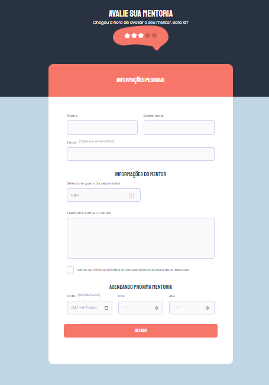

# 💻 Desafio Criando Formulários

### Nesse desafio abordaremos

- Campo select
- Campo checkbox
- Imagem centralizada no header
- Estilização do campo checkbox
- Estilização do campo select

# 🎨 Layout do desafio

 

        
  

# 🎨 Layout do desafio finalizado

 

        
  

